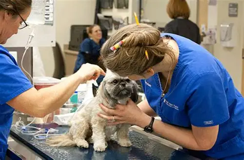
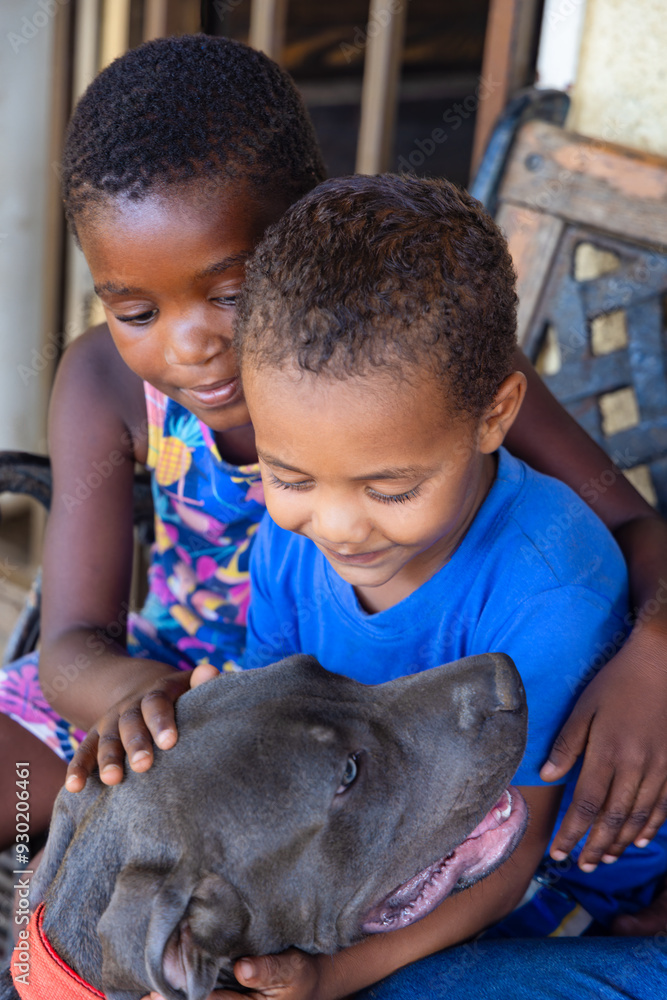
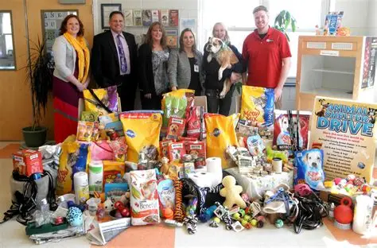

#WEDE PROJECT
 <!DOCTYPE html>
<html lang="en">
<head>
    <meta charset="UTF-8">
    <meta name="viewport" content="width=device-width, initial-scale=1.0">
 <link rel="stylesheet" href="NPO.css">
    <title>Magowa Animal shelter and rescue</title>
</head>
<header>
    <nav>
   
<li></li>

<h1>Magowa Animal Shelter and Rescue</h1>
<ul>
<li><a href="#Home">Home</a></li>
<li><a href="#Our services">Our Services</a></li>
<li><a href="#Contact">Contact</a></li>
<li><a href="#Donate">Donate</a></li>
  
<li><a href="#About us">About Us</a></li>

</ul>
</nav>
</header>
<body>
<section id="Home">
    <h2>WELCOME TO MAGOWA ANIMAL SHELTER AND RESCUE</h2>
    
Magowa Animal shelter and rescue aims to provide shelter, food and care for every animal in need.

   </section>
    
<b>Our Services</b>

    <section id="Our services">
    <ul>
        <li>Animal adoption</li>
        <li>Medical care</li>
        <li>Community education</li>
        <li>Volunteer opportunities</li>
    </ul>
    <h2>ANIMAL ADOPTION</h2>
    
Do you want to adopt an animal? Visit our shelter or contact us to learn more about our adoptable pets.

  <li></li>
     <li></li>
  <li></li>
   <li></li>

   <h3>Apply for online adoption below:</h3>
    <form action="submit_adoption_form.php" method="post">
     <label for="name">Name:</label>
     <input type="text" id="name" name="name" required>  

     <label for="Surname">Surname</label>
     <input type="text" id="surname" name="surname" required>  
    
     <label for="email">Email:</label>
     <input type="email" id="email" name="email" required>  
    
     <label for="phone">Phone Number:</label>
     <input type="tel" id="phone" name="phone" required>  

     <label for="living_condition"></label>Living Condition:</label>
     <input type="text" id="living_condition" name="living_condition" required>  

     <label for="pet">Select a Pet:</label>
     <select id="pet" name="pet" required>
          <option value="">--Please choose an option--</option>
          <option value="dog1">Dog </option>
          <option value="cat2">Cat</option>
          <option value="other1">Rabbit</option>
          <option value="other2">Bird</option>
     </select>  
     <label for="Animal breed ( for Dog or Cat)">Animal breed (For Dog or Cat)</label>
     <input type="text" id="breed name" name="animal breed" optional>   

     <input type="submit" value="Submit">
     </form>

   <h2>MEDICAL CARE</h2>
   
We have veterinarians on staff to provide medical care for all animals in our shelter.

    <li></li>
    <li></li>
    <li></li>

    <h2>COMMUNITY EDUCATION</h2>
    
We offer educational programs to raise awareness about animal welfare and responsible pet ownership.

    <li></li>
    <li></li>
    <li></li>

    <h2>VOLUNTEER OPPORTUNITIES</h2>
    
Join our team of volunteers and help us make a difference in the lives of animals in need.

    <li></li>
    <li></li>
 </section>
 <section id="Donate">
    <h2>Donate</h2>
    
Your donations help us provide care and shelter for animals in need. Consider making a contribution today.

<li></li>

You can donate online or by check.Your donation can make a huge diffence in the lives of the animals in our organisation.

<h3>Donations received in the past 3 years:</h3>

<ul>
    <li>2023: R200 000</li>
    <li>2024: R75,000</li>
    <li>2025: R350,000</li>

</section>
<section id="Contact">
    <h2>Contact Us</h2>
    <li>Email: info@magowaanimalshelter.org</li>
    <li>Telephone: +27 15 556 8763
                   +27 15 654 8764</li>
<li>Address: 452 Agelo Ave, Polokwane, South Africa</li>
</section>
<section id="About us">
    <h2>About Us</h2>
    
<b>Magowa Animal Shelter and Rescue is a non-profit organisation focused on rescuing animals in distress, and educating the community about animal welfare.</b>

    
We aim to provide a safe haven for animals in need and promote responsible pet ownership within our community.

Children are encouraged to visit our shelter and learn about animal care and welfare.

    
We aim to help every animal to be rescued and educate the community about the need to take good care of animals, and how to treat them with compassion and respect.

    
Magowa Animal Shelter and Rescue functions only because of kind donations of money, items and time. We are a purely non-profit organisation, and therefore rely solely on your kindness. There are many ways you can support us, through volunteering, donations or sponsorship.

    <li></li>
    <li></li>
    <li></li>
</section>
<footer>
   <h3>Working Hours</h3>
    
Monday - Friday: 9 AM - 5 PM

    
Saturday: 10 AM - 4 PM

 
Sunday: 10 AM - 2 PM

    
&copy; 2026 Magowa Animal Shelter and Rescue. All rights reserved.

 * {
    margin: 0;
    padding: 0;
    box-sizing: border-box;
}

body {
    font-family: 'Segoe UI', Tahoma, Geneva, Verdana, sans-serif;
    line-height: 1.6;
    color: #333;
    background-color: #f9f9f9;
}

header {
    background: linear-gradient(135deg, #2d5016 0%, #3d6b1f 100%);
    padding: 20px 0;
    position: sticky;
    top: 0;
    box-shadow: 0 2px 8px rgba(0, 0, 0, 0.1);
    z-index: 100;
}

nav {
    max-width: 1200px;
    margin: 0 auto;
    padding: 0 20px;
    display: flex;
    align-items: center;
    justify-content: space-between;
    flex-wrap: wrap;
    gap: 20px;
}

.logo img {
    height: 60px;
    width: auto;
    border-radius: 8px;
    transition: transform 0.3s ease;
}

.logo img:hover {
    transform: scale(1.05);
}

h1 {
    color: white;
    font-size: 28px;
    font-weight: 600;
    flex: 1;
    min-width: 200px;
}

nav ul {
    display: flex;
    list-style: none;
    gap: 30px;
    flex-wrap: wrap;
}

nav a {
    color: white;
    text-decoration: none;
    font-size: 16px;
    font-weight: 500;
    transition: color 0.3s ease, border-bottom 0.3s ease;
    padding-bottom: 5px;
    border-bottom: 2px solid transparent;
}

nav a:hover {
    color: #a8d5ba;
    border-bottom: 2px solid #a8d5ba;
}

#Home {
    background-image: linear-gradient(rgba(0, 0, 0, 0.5), rgba(0, 0, 0, 0.5)), url("https://i.pinimg.com/736x/7e/43/52/7e43529c2a1ecf32934fdd738707f652.jpg");
    background-size: cover;
    background-position: center;
    padding: 120px 20px;
    text-align: center;
    color: white;
    min-height: 400px;
    display: flex;
    flex-direction: column;
    justify-content: center;
    align-items: center;
}

#Home h2 {
    font-size: 48px;
    margin-bottom: 20px;
    font-weight: 700;
    text-shadow: 2px 2px 4px rgba(0, 0, 0, 0.5);
}

#Home p {
    font-size: 20px;
    max-width: 600px;
    text-shadow: 1px 1px 3px rgba(0, 0, 0, 0.5);
}

section {
    max-width: 1200px;
    margin: 0 auto;
    padding: 60px 20px;
    scroll-margin-top: 100px;
}

section h2 {
    font-size: 36px;
    color: #2d5016;
    margin-bottom: 30px;
    text-align: center;
    font-weight: 700;
    position: relative;
    padding-bottom: 15px;
}

section h2::after {
    content: '';
    position: absolute;
    bottom: 0;
    left: 50%;
    transform: translateX(-50%);
    width: 60px;
    height: 4px;
    background: linear-gradient(90deg, #2d5016, #6ba547);
    border-radius: 2px;
}

section p {
    font-size: 16px;
    color: #555;
    line-height: 1.8;
    margin-bottom: 20px;
}

#Our\ services > ul {
    background: white;
    padding: 30px;
    border-radius: 8px;
    margin-bottom: 40px;
    box-shadow: 0 2px 6px rgba(0, 0, 0, 0.08);
}

#Our\ services > ul li {
    list-style: none;
    padding: 12px 0;
    padding-left: 30px;
    position: relative;
    font-size: 18px;
    color: #2d5016;
    font-weight: 500;
}

#Our\ services > ul li::before {
    content: '✓';
    position: absolute;
    left: 0;
    color: #6ba547;
    font-size: 20px;
    font-weight: bold;
}

.image-gallery {
    display: grid;
    grid-template-columns: repeat(auto-fit, minmax(250px, 1fr));
    gap: 20px;
    margin: 30px 0;
}

.image-gallery li {
    list-style: none;
    overflow: hidden;
    border-radius: 12px;
    box-shadow: 0 4px 12px rgba(0, 0, 0, 0.1);
    transition: transform 0.3s ease, box-shadow 0.3s ease;
}

.image-gallery li:hover {
    transform: translateY(-8px);
    box-shadow: 0 8px 20px rgba(0, 0, 0, 0.2);
}

.image-gallery img {
    width: 100%;
    height: 250px;
    object-fit: cover;
    display: block;
    transition: transform 0.3s ease;
}

.image-gallery li:hover img {
    transform: scale(1.08);
}

#Our\ services li:has(img),
#Donate li:has(img),
#About\ us li:has(img) {
    list-style: none;
    overflow: hidden;
    border-radius: 12px;
    box-shadow: 0 4px 12px rgba(0, 0, 0, 0.1);
    transition: transform 0.3s ease, box-shadow 0.3s ease;
}

form {
    background: white;
    padding: 40px;
    border-radius: 12px;
    box-shadow: 0 4px 15px rgba(0, 0, 0, 0.1);
    max-width: 500px;
    margin: 40px auto;
}

form h3 {
    color: #2d5016;
    margin-bottom: 30px;
    text-align: center;
    font-size: 24px;
}

form label {
    display: block;
    margin: 15px 0 8px 0;
    color: #2d5016;
    font-weight: 600;
    font-size: 14px;
}

form input,
form select {
    width: 100%;
    padding: 12px;
    margin-bottom: 20px;
    border: 2px solid #ddd;
    border-radius: 6px;
    font-size: 14px;
    font-family: inherit;
    transition: border-color 0.3s ease, box-shadow 0.3s ease;
}

form input:focus,
form select:focus {
    outline: none;
    border-color: #6ba547;
    box-shadow: 0 0 0 3px rgba(107, 165, 71, 0.1);
}

form input[type="submit"] {
    background: linear-gradient(135deg, #2d5016 0%, #3d6b1f 100%);
    color: white;
    font-weight: 600;
    cursor: pointer;
    transition: transform 0.2s ease, box-shadow 0.2s ease;
    border: none;
    padding: 14px 30px;
    font-size: 16px;
    margin-top: 10px;
}

form input[type="submit"]:hover {
    transform: translateY(-2px);
    box-shadow: 0 6px 20px rgba(45, 80, 22, 0.3);
}

form input[type="submit"]:active {
    transform: translateY(0);
}

#Contact ul,
#Contact li {
    list-style: none;
    padding: 10px 0;
    font-size: 16px;
    color: #555;
}

#Contact li::before {
    content: '📞 ';
    margin-right: 10px;
}

#Contact li:nth-child(2)::before {
    content: '📧 ';
}

#Contact li:nth-child(3)::before {
    content: '📍 ';
}

#About\ us {
    background: linear-gradient(135deg, #f0f7e8 0%, #e8f2e0 100%);
    border-radius: 12px;
}

#About\ us p {
    font-size: 15px;
    margin-bottom: 15px;
}

#About\ us li {
    list-style: none;
}

#Donate {
    background: linear-gradient(135deg, #fffbf0 0%, #fff8e8 100%);
    border-radius: 12px;
}

#Donate div[container] {
    background: white;
    padding: 30px;
    border-radius: 8px;
    margin: 30px 0;
}

#Donate ul {
    list-style: none;
    padding: 0;
}

#Donate li {
    background: linear-gradient(90deg, #f0f7e8 0%, transparent 100%);
    padding: 15px 20px;
    margin: 10px 0;
    border-left: 4px solid #6ba547;
    border-radius: 4px;
    font-size: 16px;
    color: #2d5016;
    font-weight: 500;
}

footer {
    background: linear-gradient(135deg, #2d5016 0%, #1a2f0b 100%);
    color: white;
    text-align: center;
    padding: 40px 20px;
}

footer h3 {
    font-size: 20px;
    margin-bottom: 20px;
    font-weight: 600;
}

footer p {
    margin: 10px 0;
    font-size: 14px;
    opacity: 0.9;
}

@media (max-width: 768px) {
    nav {
        flex-direction: column;
        gap: 15px;
    }

    h1 {
        font-size: 22px;
    }

    nav ul {
        gap: 15px;
        justify-content: center;
    }

    #Home h2 {
        font-size: 32px;
    }

    #Home p {
        font-size: 16px;
    }

    section {
        padding: 40px 15px;
    }

    section h2 {
        font-size: 28px;
    }

    form {
        padding: 30px 20px;
    }

    .image-gallery {
        grid-template-columns: repeat(auto-fit, minmax(200px, 1fr));
        gap: 15px;
    }
}
   
